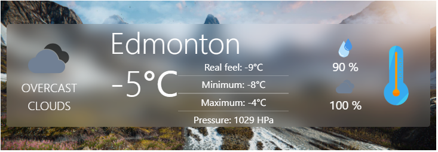

# Weather

[![Latest Version on Packagist][ico-version]][link-packagist]
[![Total Downloads][ico-downloads]][link-downloads]
[![Build Status][ico-travis]][link-travis]
[![StyleCI][ico-styleci]][link-styleci]




## Installation

Via Composer

``` bash
$ composer require prrwebcreate/weather
```

Make sure you are using Bootstrap 5.

## Usage

Simple Weather Widget powered by https://openweathermap.org/.
Install package and configure default values (config/weather.php):

api_key = your api key from https://openweathermap.org/
time_interval = time between reloads

Weather information is saved in a database 'weather'.

To use a package, you need to call the "renderWeather($name = city name, ex. 'London',$lang = language, ex. 'en','pl')" helper function in a view;
renderWeather('London','en')


## Change log

Please see the [changelog](changelog.md) for more information on what has changed recently.

## Testing

``` bash
$ composer test
```

## Contributing

Please see [contributing.md](contributing.md) for details and a todolist.

## Security

If you discover any security related issues, please email author email instead of using the issue tracker.

## Credits

- [author name][link-author]
- [All Contributors][link-contributors]

## License

license. Please see the [license file](license.md) for more information.

[ico-version]: https://img.shields.io/packagist/v/prrwebcreate/weather.svg?style=flat-square
[ico-downloads]: https://img.shields.io/packagist/dt/prrwebcreate/weather.svg?style=flat-square
[ico-travis]: https://img.shields.io/travis/prrwebcreate/weather/master.svg?style=flat-square
[ico-styleci]: https://styleci.io/repos/12345678/shield

[link-packagist]: https://packagist.org/packages/prrwebcreate/weather
[link-downloads]: https://packagist.org/packages/prrwebcreate/weather
[link-travis]: https://travis-ci.org/prrwebcreate/weather
[link-styleci]: https://styleci.io/repos/12345678
[link-author]: https://github.com/ecommerce
[link-contributors]: ../../contributors
